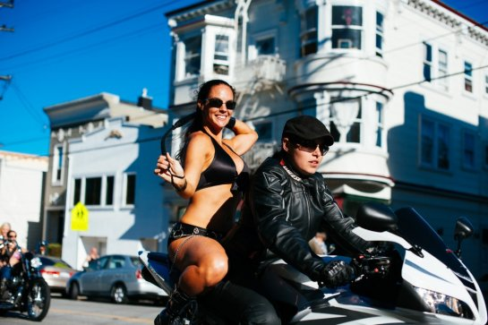

# People Watching



You know all that spare time you have? I hate it. Don't you? 

Well, for centuries, people have been ridding themselves of pesky spare time through the hobby of staring at strangers in public and wondering about them. 

Want to try it? Follow me! 

## Getting started

First, let's cover some **extremely important ground rules**

```
1. Did you see the part above where I said "in public"? That's important. 
2. No photography.
3. Pay attention to your surroundings and wear appropriate gear.* 

* For instance, people watching during the winter holidays is a satisfying excursion. 
Especially in a snowstorm! 
But, in that case, be sure to wear a *parka*. 
Many peoplewatchers have lost their lives to exposure, starvation, and/or severe sunburn. 
```

>"ALWAYS do a thorough gearcheck before you peoplewatch!" 
- Me.

## More information

- [omg](http://www.huffingtonpost.com/candace-davis/people-watching-harmless-_b_5560023.html)
- [there are so many](https://en.wikipedia.org/wiki/People_watching)
- [more peoplewatching resources](http://lonerwolf.com/people-watching/)
- [than I anticipated](https://foursquare.com/top-places/san-francisco/best-places-people-watching)
